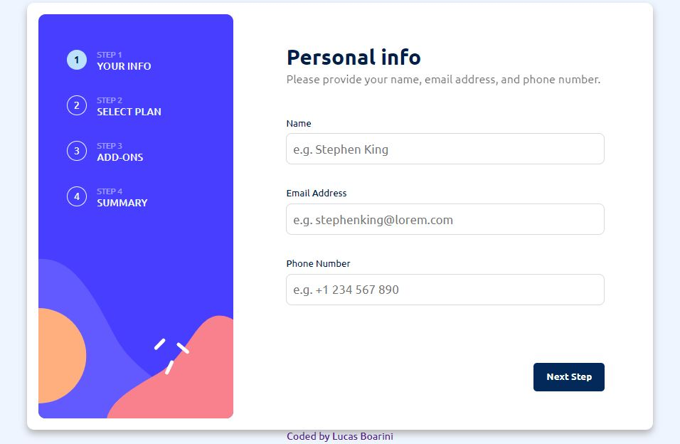

# Multi Step Form

Nesse projeto irei desenvolver uma aplicação onde o usuário irá realizar um cadastro em um formulário para contratação de serviço, onde consiste em contratar serviços de jogos com diferentes planos para escolha.

## Menu

- [Meu Processo](#meu-peocesso)
- [Screenshot](#screenshot)
- [Link](#link)
- [Construido com](#construido-com)
- [Contatos](#contatos)

### Meu Processo

O desenvolvimento desse projeto irá me ajudar a aprimorar meus conhecimento em HTML, CSS e JavaScript, e para o desenvolvimento desse projeto estou utilizando os passos conforme listados abaixo:

- [X] Montar estrutura básica do formulário;
- [X] Desenvolvimento do Sidebar Desktop;
- [X] Design passo 1 do formulário;
- [X] Validação dos campos do formulário passo 1;
- [X] Validação de e-mail;
- [X] Design passo 2 do formulário;
- [X] Implementar função no toggle de planos anuais ou mensais passo 2;
- [X] Desenvolver funções para botão “go back” e “next step” passo 2;
- [X] Design passo 3 do formulário;
- [X] Implementar funções para botão “go back” e “next step” passo 3;
- [X] Design passo 4 do formulário;
- [X] Funções botões passo 4;
- [X] Design da página de agradecimento (passo 5);
- [X] Desenvolver métodos para controle de opções escolhidas pelo usuário;
- [ ] Criar funçãos para exibir escolhas do usuário no resumo final;
- [ ] Mensagem de agradecimento;
- [ ] Implemtar responsividade;

### Screenshot

<!--Abaixo estou deixando um screenshot do design final do projeto conforme desenvolvi:-->

<!---->

### Link

<!--Estou deixando abaixo o link com o deploy do projeto para visualização direto no navegador:-->

<!--    - Para acessar o App clique [aqui](https://calculator-app-main-lake.vercel.app/)-->

### Construido com

As tecnologias utilizadas para esse projeto são as listadas abaixo:

- Semantic HTML5 markup
- CSS custom properties
- JavaScript

### Contatos

[LinkedIn](https://www.linkedin.com/in/lucas-boarini)